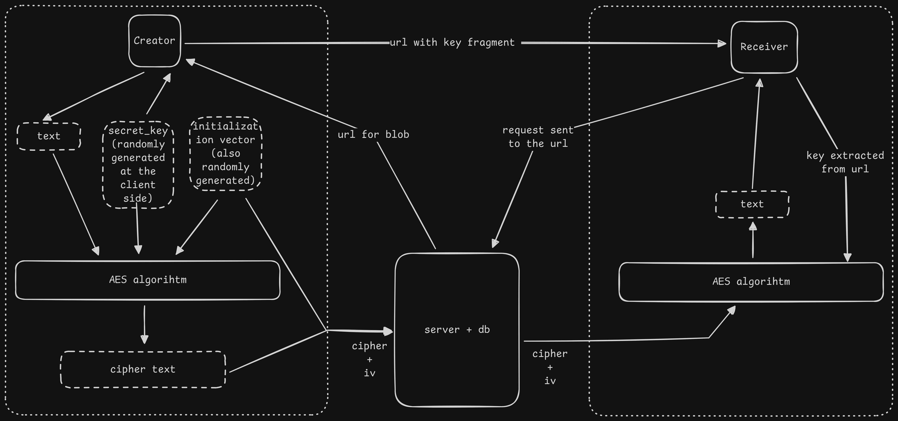
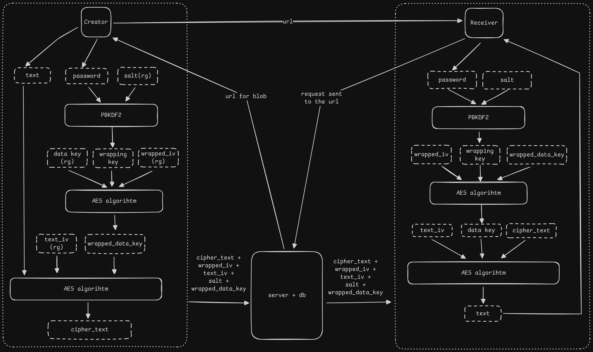

# Vault - Web Client

[](https://vercel.com/new/clone?repository-url=https%3A%2F%2Fgithub.com%2FSid-op777%2Fvault-frontend)
[](https://opensource.org/licenses/MIT)


This repository contains the source code for the Vault web client. Vault is a zero-knowledge, encrypted snippet-sharing service. This frontend application performs all cryptographic operations directly in the user's browser, ensuring that unencrypted data never leaves their machine before being secured.

**Live Project:** [https://vault.nx7.tech](https://vault.nx7.tech)

**Backend Repository:** [https://github.com/Sid-op777/vault-backend](https://github.com/Sid-op777/vault-backend)

---

## System Architecture: Client-Side Security

Vault's security model is centered on performing all encryption and decryption within the browser using the standard **WebCrypto API**. The backend server only ever receives and stores an opaque, encrypted blob of data, making it a "zero-knowledge" system. The decryption key is never transmitted to the server.

### Cryptographic Flow

The diagrams below illustrate how the client handles encryption, ensuring the server never has access to the secret key.


| Password-less Flow (Key in Fragment) |
| :---: |
|  |

| Password-Protected Flow (Key Wrapping) |
| :---: |
|  |

---

## Key Features

- **End-to-End Encryption:** Utilizes AES-256-GCM for strong, authenticated encryption of all data.
- **Optional Password Protection:** Implements an additional layer of security by wrapping the data encryption key with a password-derived key using PBKDF2.
- **Zero-Knowledge Architecture:** The decryption key is either passed via the URL fragment (which is never sent to the server) or derived from a user-provided password.
- **Modern and Responsive UI:** A clean, intuitive interface for creating and viewing secrets, built with Radix UI and Tailwind CSS.
- **Dynamic Metadata Display:** Shows remaining views and time-to-expiry in real-time based on data from the API.
- **Secure Deletion:** Supports manual, immediate revocation of shared links via a unique token.

---

## Technology Stack


| Component | Technology |
| :--- | :--- |
| Framework | **Next.js 14** (App Router) |
| Language | **TypeScript** |
| Styling | **Tailwind CSS** |
| UI Components | **Radix UI / shadcn/ui** |
| Crypto | **WebCrypto API** (Browser Standard) |

---

## Local Development Setup

Follow these instructions to set up the frontend for local development. This requires a running instance of the `vault-backend`.

### Prerequisites

- Node.js (v18 or newer)
- npm, pnpm, or yarn

### Installation and Execution

1.  **Clone the repository:**
    ```bash
    git clone https://github.com/Sid-op777/vault-frontend.git
    cd vault-frontend
    ```

2.  **Install dependencies:**
    ```bash
    npm install
    ```

3.  **Create the local environment file:**
    Create a `.env.local` file in the root of the project. This file tells the frontend where to find the backend API.
    ```dotenv
    NEXT_PUBLIC_API_URL=http://localhost:8080
    ```
    *Note: This URL must point to your locally running instance of the `vault-backend`.*

4.  **Run the development server:**
    ```bash
    npm run dev
    ```
    Open [http://localhost:3000](http://localhost:3000) with your browser to see the result.


---

## License

This project is licensed under the MIT License. See the [LICENSE](LICENSE) file for details.